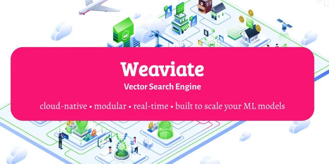

<!-- TODO: Tasks pending completion -@andreiaksionov at 3/28/2022, 2:56:47 PM -->
<!-- finish readme file -->

<h1 align="center">Welcome to Weaviate Demo</h1>

<p align=center></p>

This is a demo of how to use [Weaviate](https://weaviate.io/).

What is Weaviate you might ask. Well according to official website:
> Weaviate is an open source vector search engine that stores both objects and vectors, allowing for combining vector search with structured filtering with the fault-tolerance and scalability of a cloud-native database, all accessible through GraphQL, REST, and various language clients.

In other words Weaviate is a search engine that is built with semantic search in mind which means that it has optimizations for quick vector search. Plus it also provides traditional text search with ability to add filters into request. And it's all done in one go, all on Weaviate's side. So it's fast, modern and flexible.

Examples of how to use Weaviate can be found in:

- [quick start guide](https://weaviate.io/developers/weaviate/current/getting-started/quick-start.html): under each request there is a link to Weaviate's console where you can run request in a real time
- [youtube channel](https://www.youtube.com/c/SeMI-and-Weaviate/videos), you can start with [introduction video](https://www.youtube.com/watch?v=IExopg1r4fw)
- and of course in this repository :)

# Project structure

- **data**
  - **raw**: contains csv file with article from CNBC website and scrapped by [data.world](https://data.world/crawlfeeds/cnbc-news-dataset)
- **docs**
  - *api_calls.rest*: endpoint call examples
- **notebooks**: notebooks are also can be rendered by [nbviewer](https://nbviewer.org/)
  - *1.EDA*: exploratory data analysis notebook where each column of the dataset is described
  - *2.data_preprocessing*: for this demo project data preprocessing is done in form of notebook
  - *3.weaviate_search_examples*: here you can find different variants of search requests
- **src**
  - **config**
    - *config.yaml*: config file
  - **data**
    - *data_loader.py*: this data loader parses schema from running Weaviate instance and automatically creates all required objects and references. More about it in this [Readme](src/data/README.md)
  - **docker**
    - *docker-compose.yml*: speaks for itself. In order to create new docker-compose file you can use Weaviate docker-compose [generator](https://weaviate.io/developers/weaviate/current/getting-started/installation.html#customize-your-weaviate-setup)
  - **models**
    - *schema.json*: specifies classes, properties, data types and references for the data. More about it in this [Readme](src/models/README.md)
  - **utils**: various utils files
- *main.py*: script that loads data into running Weaviate instance and as a check runs search request and outputs result.
- *pyproject.toml*: package dependencies are stored here and managed py [Poetry](https://python-poetry.org/)

# How to use it

In order to use this project (with the provided CNBC dataset) you need to do these steps:

1. Install all the required packages. In this project package dependencies are managed by [Poetry](https://python-poetry.org/) and are stored in "pyproject.toml" file. After `poetry` is installed and virtual environment is created (in case you don't want poetry to create it [automatically](https://python-poetry.org/docs/configuration/#virtualenvscreate)), run:

    ```bash
    poetry install
    ```

2. Run notebook with preprocessing *(notebooks/2.data_preprocessing.ipynb)*. This notebook as a result will create csv file in *data/interim* folder that later can be used for sending data into weaviate instance.
3. Run docker-compose file from *src/docker/docker-compose.yml*. This will download all necessary images and start weaviate instance with specified [modules](https://weaviate.io/developers/weaviate/current/modules/index.html).

    ***
    **NOTE**:  in this project custom text2vec-transformers image is used which can be created from this [repository](https://github.com/Andrei-Aksionov/weaviate-t2v-module) (there you can also find out how to create text2vec-transformers module with you desired way of text vectorization). If it doesn't fit your needs here is a [list](https://weaviate.io/developers/weaviate/current/retriever-vectorizer-modules/text2vec-transformers.html) with prebuilt images; just change image value (line 27 in docker-compose.yml) with the image name from that list.
    ***

4. Load data into running Weaviate instance. For this simply run:

    ```python
    python main.py
    ```

# Weaviate console

When Weaviate instance is running with data inside it, Weaviate's console can be used. For that just open in your browser:
> <http://console.semi.technology/>

  ... provide host and port (most likely it will be <http://0.0.0.0:8080>) and hit "Connect" button.

Now you can create search request in [GraphQL](https://weaviate.io/developers/weaviate/current/graphql-references/get.html) format (examples can be found in *3.weaviate_search_examples.ipynb*, chapter 2).

For example this request will output top 5 articles with certainty more then 0.8 and articles will be about oil prices and Saudi Arabia and US relations:

```graphql
{
  Get {
    Article(
      limit: 5
      nearText: {
        concepts: ["Saudi Arabia US relations and oil prices"],
        certainty: 0.8,
      }
    )
    {
      published_at
      title
      short_description
      _additional {
        certainty
      }
      hasAuthors {
        ... on Author {
          name
        }
      }
    }
  }
}```
